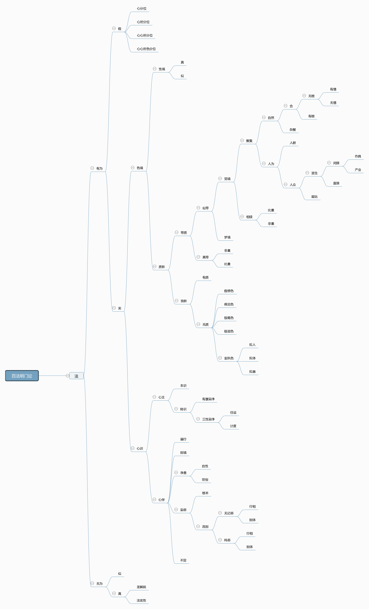

# 百法明门论的宇宙观

交芦子曰：百法明门论，天亲大士作也。法者、轨范物解，任持自性；故法与物，异名同义，百法犹云百物耳。列举此百法者，则以统摄群有也。统摄群有之论，天竺之胜论师六句，数论师二十五法，近世英吉利人穆勒约翰之意、神、形、法四句胥是也。然胜论、数论，吾教大、小乘论师破斥殆尽；而穆勒四句，余亦尝论大略，其抉择当否，可概见已。抑穆勒辩家也，其正鹄在尽列可名可言之物耳，逾此则非所思存。今百法明门论则不然，盖详列百法，仅明所由之门耳。门者，由义、通义、入义，今举百法以明能通入之门，而由百法明门所通入者，犹别有宗趣存焉。

　　宗趣维何？约之不出二义；一、断染成善。案：历来释斯论者，均以百法区为五对：一、无为有为，二、假实，三、心色，四、心王心数，五、善心数染心数。第一对综该百法，第二对则遗无为，第三对则更遗假法，第四对则更遗色法，第五对则更遗心王及遍行、别境、不定心数，但十一善心数、二十六染心数而已。所以如是分别者，欲令修佛法者，知改流转为常寂、净烦恼为菩提，唯在成此十一善心数、断此二十六染心数，得其舍凡成圣之枢要也。二、祛执证理。案：中道大乘，一切唯心，今列陈百法，正以明百法皆不离心识耳。心识之宗，曰如来藏。如来藏无执，末那执之、则曰阿赖耶。执阿赖耶见分为自内我，则曰末那。由之而辨其体相、业用、本末、因果，乃有八识心王。与心王定相应者，则有五十一心数。心王、心数、变起见分所了别境，则有十一色法。依心、心所、色、分位差别，则有二十四不相应假法。其无为法则心识之实性也。故五位百法、皆唯有识，一切愚夫执有实体、执有主宰。若了唯识，则知我法皆横计起。但离横计、实无我法，我法执祛，则契证如来藏性矣。然大乘诸论，陈列法相或有增减详略，五位亦别有开合。如大宗地玄文本论则开五位为十种，加色主、非有为非无为、亦有为亦无为、俱俱、俱非五种。言色主者，犹近人所云原质，即四大种──坚、湿、暖、轻；楞严七大、瑜伽十界、皆详言之。乃随俗假说，非实物有，故玆不列。言非有为非无为者、即法性真如也。言亦有为亦无为者、即心心所之业用也。言俱俱者、即百法之都称也。言俱非者、遣相归性，百法皆不可思不可说也。义有开合、法无多寡，其宗趣亦莫不一致。举一反三，在学者之善悟耳。至小乘诸部，大都依根本一切有宗建立七十五法。虽法相略减，非大小乘殊别之要义也。其要义在小乘法有而我空，色法、不相应法、无为法皆心外实有；大乘法我双空，决定无心外实法，则大小乘所由判也。然不能思择群有，穷尽无遗，又焉知心外无物，决定唯识乎！此观百法所以尚矣。为令学者易明，制一统摄分类表如下：

此表所类别者，以法为干，首区为有为、无为。无为区真似二支。似无为者，即论中虚空、不动灭、想受灭三全分，及非择灭、缘阙不生一分。以真无为为干，又分二支：一、圣解脱。谓三乘果人所证无余涅槃，即论中择灭无为也；二、法实性。即论中真如无为及非择灭本性清净之一分也。然无为法唯一真如，云何有六？盖随有为所显、假说差别，犹以破人法二执、说人法二空，依三性说三真如，依十地说十种真如耳。

　　次依有为区假实二支：实者实物，一一皆实有种相体用。假有三种，曰聚集假，相续假，分位假。此二十四种不相应行，乃分位假，以即是心、心所、色实法上之分位差别故。然是依他所起，非遍计所执。盖心、心所、色上本具之分位差别，与心、心所、色实法同一仗因托缘生起，非若独影无质之境可由遍计妄执而有也。穆勒之相似不相似、并存不并存二法，摄论之世识、数识等十一识，康德之十二原型观念，虽或尽理或不尽理，胥此分位假法也。此假区四；一、心分位，即命根是，以唯依异熟识种连持功能假立故。二、心所分位，即异生性是，以唯依烦恼所知二障染种假立故。三、心、心所分位，即无想定、灭尽定、无想报是，以此三位皆依心、心所二法断灭假立故。四、心、心所、色分位，即余十九种不相应行是。以得、流转、势速等，心法、心所法、色法皆有，即依此三法假立故。但色法不能独有，必由心、心所变起，故一切唯识。

　　次依有为实物，区心识色境二支。心识又区为二：一、心主，二、心伴。心主即眼、耳、鼻、舌、身、意、末那、阿赖耶等八识。又区为二：一、本识，即阿赖耶识。二、转识，谓前七识，依本识转变而起。又区为二：一、有覆染净，即末那识。二、三性染净。又区为二：一、计度，即第六意识；二、任运，即眼、耳等前五识。次及心伴。心伴者，为心伴侣、定相应心，不能自在，必依心起也。大区为五：一、遍行有五，二、别境有五，三、净善有十一，四、染恶有二十六，五、不定有四，悉如论中自分。而净善又二：一、自性，即善心所中信等前八也。二、世俗，即行舍、不放逸、不害也。染恶亦二：一、根本，即根本烦恼也。二、流别，乃根本之差别分位、等起流类也。又区为二。一、纯恶有二：曰、别体，谓别有自体者，即无惭、无愧是。曰、行相，谓但是根本之差别行相，即忿、恨、恼、覆、害、嫉、悭是。以此九族、定不与善心所共起，故曰纯恶。二、无记恶亦有二：曰、别体，即不信、掉举、懈怠、惛沉、散乱是。曰、行相，即谄、诳、憍、放逸、失念、不正知是。以此十一族、亦通无记，可与善心所并作不悖，故曰无记、恶，谓其无记与恶之二性也。

　　次依色境，又分为二：一、性境，二、质影。性境者：第八识、第六识，及前五识依第八中色种变起自见分所缘亲相分也；如见黑、白，如触冷、暖，得境自性非共差别，不可言寻，故曰性境。此又分二：一、真性境，即前五识及同时意识未起分别所缘色声等六尘亲得其自相者，兼五、八识所缘及定果色等。二、似性境。若五净色根、无表色等，但从发识防过殊胜功能建立，不能亲得其自相，故曰似性境。案：此论百法，六种无为、是圆成实性，余九十四种、皆依他起性，无遍计所执性。而色境中质影之境、则属于世间世俗法，系属遍计执性；亦是我法等分别执见所安足处，故百法论之所不摄。然世间愚夫，颠倒执着、由来久矣。近今浮辩相尚，恶慧弥深，顺时机故、遣迷情故，强为解说，诚不能已。否则昧者且以为百法论摄法不尽；俾知质影、皆唯识心变起，都无本质，故随世分别、表中以质影独建一干，广摄诸无体假法。

　　质影无自体相，但由周遍计度之妄念、执心心所及所缘性境与原型分位等增益而起。此又分二：一、带质，二、独影。带质虽不得色、声等自相，犹挟带色、声等相质而起，譬如触之得坚、因名曰坚，坚之一名虽遍于一切坚物上转，而今名曰坚、实因触得之坚而起。触得之坚即身识所领触尘自相，亲得自相名曰性境；今坚之意言、实挟带身识所领坚触自相而起，非无因凭空而起、故曰带质。特嘉尔所云意境，义颇符顺。此又分二：一、真带质。以心缘心，中间相分从两头生，两头有质。此有比、非二量：云何非量？谓末那缘阿赖耶见分为自内我，及意识缘诸心所法而比度错谬者。云何比量？谓意识缘诸心所法、比度不错谬者。

　　二、似带质：以心缘境，中间相分从能缘生，一头有质。此又分二：一、梦境：对觉言梦，觉时梦空，梦时非空同乎觉境，其相广如觉境中辨。二、觉境，指吾人现前之对境也。又分为二：一、相续相：案：凡相有五：一曰自相、性境是也，二曰共相，三曰差别相，四曰因相，五曰果相、带质境是也。而带质境中因相、果相、曰相续相，在心心所所缘性境上依时、数、名、句、文、命根等原型分位而增益起者也。此亦有比非二量：云何比量？如佛说三世染净因果等，又如生者必灭、人皆有死等。云何非量？如达尔文取证地质中僵石、妄计万物进化等。要之、凡因果例合于正理，不畔现量者，皆曰比量。其乖悖现量、不应道理者，皆曰非量。

　　二、聚集相。即带质境中之共相、差别相，在心心所所缘性境上依方、数、名、句、文、众同分、命根等原型分位而增益起者也，但指刹那现境。前后三世相续相摄，则非此所摄矣。此又分自然、人伪二种。自然者、犹近人所云自然界之事物也。自然又二：一、杂聚：杂聚者，身非一身，与身俱生，共众多身聚在一处，如曰草丛木林石聚等，凡未经人为设置者皆是也。即小儿初生、虽不自辨为何姓、何族、何国，逮其能自辨时、必为所生之姓、族、国人无疑。夫种族、国、姓、诚由人伪增踊而起，然是前人所为，而彼孩稚兹堕数中，则但是夙业所招无记果，故亦可属之自然杂聚。余动物等、可以类推。然木丛石聚等，一经人类栽砌摄受，则又属于人伪矣。故杂聚通自然、人伪，此所诠者、则自然之杂聚也。二、一合：一合者，色心等多物合成一身者也。积聚曰身，一身犹云一聚耳。此又分二：一、无根：世俗曰五官，圣教曰五根，故无根即世人所云无官品也。根者，增长、滋养、执受、连持之义，凡物无此诸义者、概曰无根。一滴水与一海水无殊也，一微尘与一地球无殊也，一寸石与千仞岗无殊也，一爟火与一日轮无殊也。无官品之别别一体者、及有根无情之枯木等，有根有情之死尸等，皆此所摄。然今所诠者，在自然而合成一聚者。若范金为圆、则曰一圆等，则又人伪所摄矣。二、有根者，又分为二：一、无情族：情者情识，无现行之觉知者则曰无情，草身、树身等植物皆是。二、有情族：有现行之觉知者也，虫身、鱼身、禽身、兽身、人身等动物皆是。自然界物，尽于是矣。

　　次释人伪：人伪者，由人之作为积习而起者也。然有情之类，皆有作为积习而起者，如蜂窝、如蚁穴、如蛛网、如鹊巢；今对人类说法、重在人事，故单言人伪耳。此又区二：一、人群：若家属、种族、国民、教徒、军队、政府、士、农、工、商团等，皆随习俗而异，定其伦眷，若震旦有君臣、父子、夫妇、兄弟、师友之五伦者。今此但辨人群之相耳，而群伦中之义务、道德等，则又人业所摄矣。二、人业：凡人群所取受作为之事业，皆属之。此又分资生、观玩二种，资生之业又二：一、直接者，衣被、饮食、床座、宫室等。二、间接者，又分为二：一、作具，农器、工器、军器、舟车、书契、法律、礼制、钱币等。二、产业，领土、田宅、仓廪、菽帛，及主所摄受畜养之臣妾子女牛马禽虫等。而人所造作、人所摄受，非直接间接之资生事物，无关活命因缘者，则皆属之观玩之业。人伪界物，亦尽于是矣。以上皆质影中带质之境也。

　　次依独影境又分为二：一、有质独影：非无实质，但界代间隔、不亲得质，不托质起，唯从见生，故曰独影；如佛无漏假智能缘有漏界色等。二、无质独影：绝无本质，但由意识强思计度想像刻画而起，或由病狂迷罔而起。此共分为五：一、假想色：如意识所分别之受所引色、观想色，及散心追忆过去、幻想未来之色境等。二、病见色：若病目者、空中见华起灭，及病狂者无中见有、有中见无等。三、极略色：如近人所云无穷小之莫破质等；此在圣教，本属假想观慧境之一，愚夫缚于原型之七识法见我、执着为实，故别出之。四、极迥色：如愚夫所执着之明暗分齐、宇宙边际等；在圣教亦但是假想观慧境之一，盖依名、句、时、方、数量等原型分位析之极微极远之谓。但是自心之碍相，更无他物。五、妄执色：此妄执色，皆由独头乱识托原型之名、句、文及我法见、随顺邪教邪思计度刻想而成，唯是无法；虽龟毛兔角不得喻也。此又分三：一、拟人者：若震旦所计昊天上帝，欧美、大食所计造物主，天竺所计大自在天等；凡拟同人、畜、言有士夫用而生化万物，为万物本原及主宰者，皆是也。二、拟体者：如震旦所计太极、元气，天竺所计实性、大有，欧美所计原神、原形、原质、原力等；凡执心外实有一物或二物为宇宙真体者，皆是也。三、拟器者：除前二计，余一切等。略出三种，概举妄执。要之，凡不亲现量、不合比量，所计非量境界之无法妄执为实者，皆此妄执色所摄。

　　观此统摄分类表及其说明，可知百法论该摄宇宙万有，罄尽无遗矣。持斯论以研核观察乎万物，物将何遁者！

　　作者初研究唯识学，文虽大致可观，而名相间有错误之处，未及详审，请阅者指教之！（见海刊一卷五期）